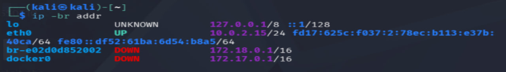
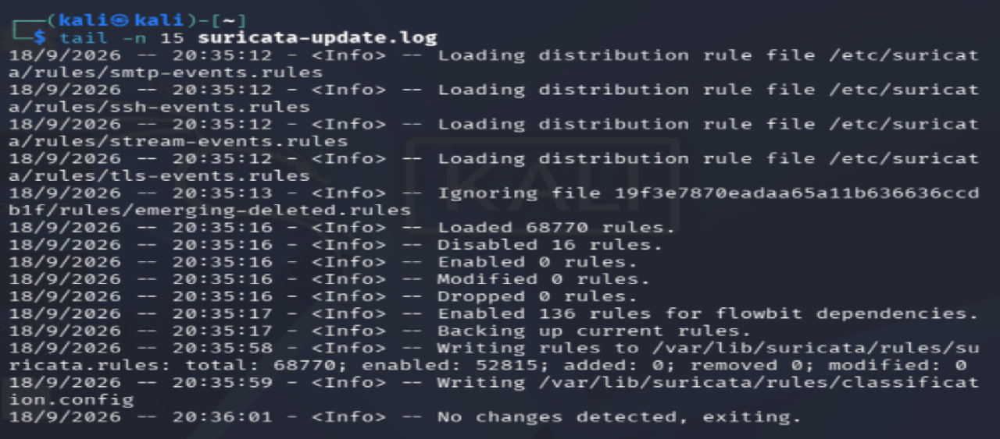
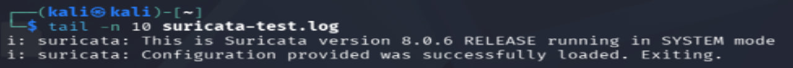
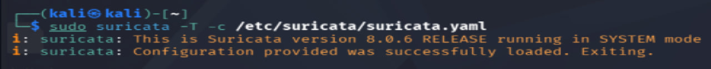
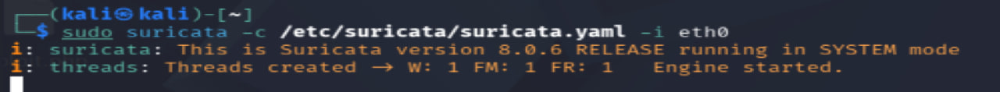

# Task 4: Network Intrusion Detection System (IDS)

## Project Overview

This project demonstrates a basic Network Intrusion Detection System (IDS) using Suricata on Kali Linux.

Suricata monitors network traffic and generates alerts when traffic matches predefined detection rules. A custom ICMP detection rule was created and tested in a controlled lab environment.

## Objectives

- Install and configure Suricata.
- Update network intrusion detection rules.
- Create a custom detection rule.
- Monitor network traffic.
- Detect and analyze security alerts.

## Tools Used

- Kali Linux
- Suricata 8.0.6
- ICMP (Ping)
- Emerging Threats Open Rules
- Linux Terminal

## Network Configuration

The active network interface used for monitoring was:

| Setting | Value |
|---|---|
| Network Interface | eth0 |
| Local IP Address | 10.0.2.15 |
| Monitoring Tool | Suricata |

## Implementation Steps

### 1. Suricata Installation

Suricata was installed on Kali Linux and its version was verified.

### 2. Rule Updates

The `suricata-update` utility was used to download and configure detection rules from Emerging Threats Open.

The update process reported:

- Rules loaded: 68,770
- Rules enabled: 52,815
- Rules written successfully to `suricata.rules`

### 3. Configuration Testing

The Suricata configuration was tested using:

```bash
sudo suricata -T -c /etc/suricata/suricata.yaml
```

The configuration was successfully loaded.

### 4. Custom Detection Rule

A custom ICMP detection rule was created in `local.rules`.

```text
alert icmp any any -> $HOME_NET any (msg:"LOCAL ICMP Ping Detected"; sid:1000001; rev:1;)
```

This rule generates an alert when ICMP traffic is detected toward the local network.

### 5. Network Monitoring

Suricata was started on the `eth0` interface using:

```bash
sudo suricata -c /etc/suricata/suricata.yaml -i eth0
```

The Suricata engine started successfully.

### 6. Traffic Generation

ICMP traffic was generated using:

```bash
ping -c 4 8.8.8.8
```

The traffic was used to test whether the custom detection rule generated an alert.

## Testing and Results

Suricata successfully detected the ICMP traffic and generated the following alert:

```text
[1:1000001:1] LOCAL ICMP Ping Detected
```

### Alert Details

| Detail | Result |
|---|---|
| Alert Message | LOCAL ICMP Ping Detected |
| Rule SID | 1000001 |
| Protocol | ICMP |
| Source | 8.8.8.8 |
| Destination | 10.0.2.15 |
| Log File | `/var/log/suricata/fast.log` |
| Detection Status | Successful |

## Evidence Screenshots

### 1. Network Interface



### 2. Suricata Rules Update



### 3. Configuration Test Summary



### 4. Configuration Successfully Loaded



### 5. Suricata Engine Started



### 6. ICMP Alert Detected


## Conclusion

This project provided practical experience with:

- Network traffic monitoring
- Intrusion detection systems
- Suricata configuration
- Custom detection rules
- Security alert analysis
- Linux-based security tools

The custom ICMP detection rule was successfully tested, and Suricata generated an alert when matching traffic was detected.

## Ethical Considerations

All testing was performed in a controlled lab environment. Network monitoring and security testing should only be conducted on systems and networks where proper authorization has been granted.
